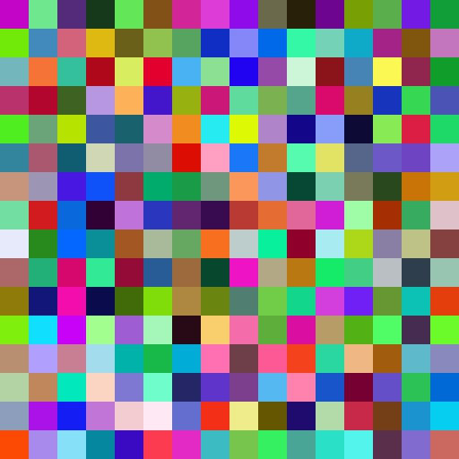
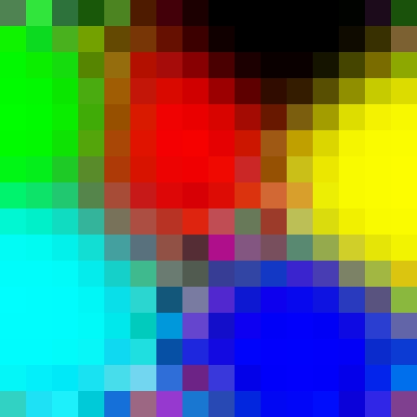
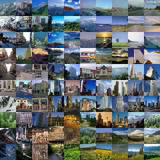

.. Tutorial on Self-Organizing Map for pictures classification.

Classification non-supervisée d'images par carte auto-adaptative
================================================================

Résumé
------
L'objectif de ces travaux pratiques est d'utiliser une méthode descriptive, la carte auto-adaptative [#wikipedia_som]_ , pour la classification et la visualisation de données multidimensionnelles non-supervisées. 
Nous étudierons tout d'abord le comportement des paramètres d'apprentissage d'une carte pour la classification de couleurs.
Ensuite,nous utiliserons ces cartes pour la classification de paysages sous forme d'images fixes via le descripteur GIST à 960 dimensions.

Prise en main
-------------

Rappel de l'algorithme : 
  1. Initialiser chaque noeud de la grille.
  2. Un vecteur d'entrée est choisi aléatoirement dans le jeu de données d'entrainement et est présenté au réseau.
  3. Pour chaque noeud du réseau, calculer la distance avec le vecteur présenté. Le plus proche, le gagnant, est communément appellé ``Best Matching Unit (BMU)``.
  4. Calculer le rayon de voisinage :math:`\sigma` du BMU.  Cette valeur, grande au départ, diminue à chaque itération.  

:math:`\sigma(t) = \sigma_e^{(-t/\lambda)}`

Constante de temps : :math:`\lambda` = nombre d'itérations / largeur de la carte

  5. Tous les noeuds présents dans le rayon du BMU sont ajustés pour
  ressembler au vecteur d'entrée. Plus le noeud est proche du BMU, 
  plus ses poids sont altérés.  

:math:`w_{r}^{t+1} = w_{r}^{t}+ \Delta w_{r}^{t}`

:math:`\Delta w_{r}^{t} =  \epsilon \cdot h \cdot (v - w_{r}^{t})`

Coefficient d'apprentisage : :math:`\epsilon = \epsilon(t) = \epsilon_0e^{(-t/\lambda)}`

Fonction de voisinage : :math:`h(r,s,t)= \exp \left( - \frac{\left\| \vec{r} - \vec{s} \right\|}{2 \sigma^{2}(t)} \right)`

  6. Répéter depuis l'étape 2 pour N itérations.

Utiliser le module python kohonen pour classer 6 couleurs
~~~~~~~~~~~~~~~~~~~~~~~~~~~~~~~~~~~~~~~~~~~~~~~~~~~~~~~~~

Les couleurs seront nos descripteurs multidimensionnelles (3 dimensions [r,g,b])

Nous entrainerons une carte initaliser aléatoirement avec 6 couleurs différentes.
Vous devriez obtenir les résultats suivants : 

   Avant apprentissage 	     

   Après apprentissage des 6 couleurs 

Faire varier les paramètres et commenter l'implémentation du module kohonen
~~~~~~~~~~~~~~~~~~~~~~~~~~~~~~~~~~~~~~~~~~~~~~~~~~~~~~~~~~~~~~~~~~~~~~~~~~~

* pas d'apprentisage
* constante de temps 
* rayon de voisinage 

Classification de paysages
---------------------------

Nous utiliserons le corpus `spatial envelope <http://people.csail.mit.edu/torralba/code/spatialenvelope>`_

Télécharger les données
~~~~~~~~~~~~~~~~~~~~~~~

Inspirez-vous du Makefile en annexe

Extraire les descripteurs GISTS
~~~~~~~~~~~~~~~~~~~~~~~~~~~~~~~

* Via python utiliser le module pyleargist : https://bitbucket.org/scamp/pyleargist
* Via l'application C++ : http://lear.inrialpes.fr/src/lear_gist-1.1.tgz

Utiliser le module Kohonen pour générer une classification des paysages
~~~~~~~~~~~~~~~~~~~~~~~~~~~~~~~~~~~~~~~~~~~~~~~~~~~~~~~~~~~~~~~~~~~~~~~

Le corpus présente huit classes de paysage (mountain, open country, tall building, forest, coast, highway, inside city, street)

   Classification des paysages

Appendice
---------

Récupération et formatage des données 
~~~~~~~~~~~~~~~~~~~~~~~~~~~~~~~~~~~~~

.. literalinclude:: ../src/pics_som/Makefile
   :language: make	    

Calcul des GISTS
~~~~~~~~~~~~~~~~

.. literalinclude:: ../src/pics_som/kohonen.py

Utiliser le script color_map.py pour créer des carte auto-adaptatives
~~~~~~~~~~~~~~~~~~~~~~~~~~~~~~~~~~~~~~~~~~~~~~~~~~~~~~~~~~~~~~~~~~~~~~

python color_map.py -h
Usage: color_map.py [options]

Options:
  -h, --help            show this help message and exit
  -s SIZE, --size=SIZE  size of the map
  -i NBITER, --iter=NBITER
                        number of iteration
  -l LR, --lr=LR        learning rate

.. literalinclude:: ../src/pics_som/color_map.py

Classification des paysages
~~~~~~~~~~~~~~~~~~~~~~~~~~~

.. literalinclude:: ../src/pics_som/gist_map.py

Implementation des cartes de kohonen
~~~~~~~~~~~~~~~~~~~~~~~~~~~~~~~~~~~~

.. literalinclude:: ../src/pics_som/kohonen.py

.. rubric:: Notes

.. [#wikipedia_som] http://fr.wikipedia.org/wiki/Carte_auto_adaptative